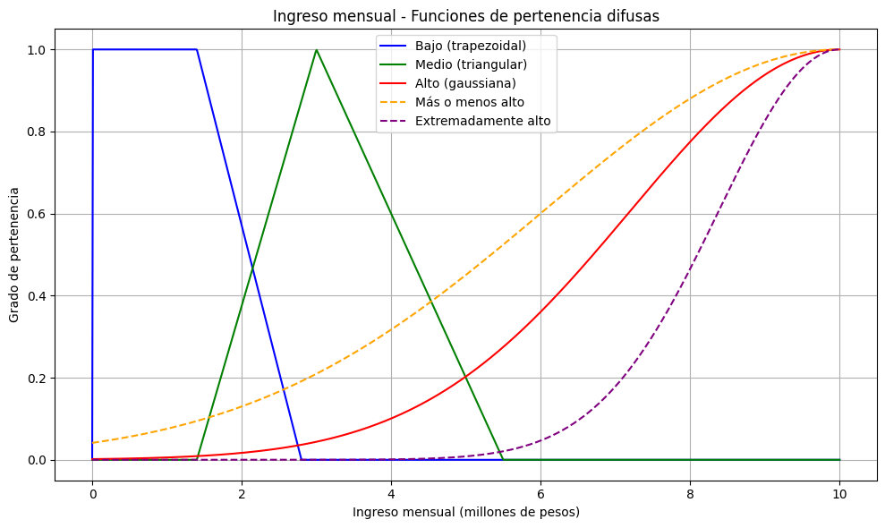
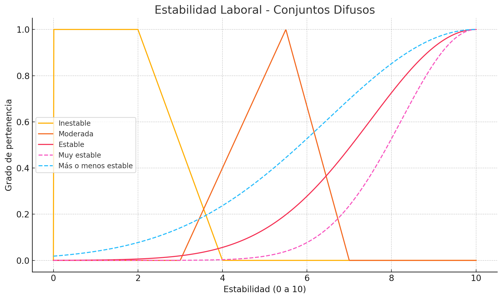
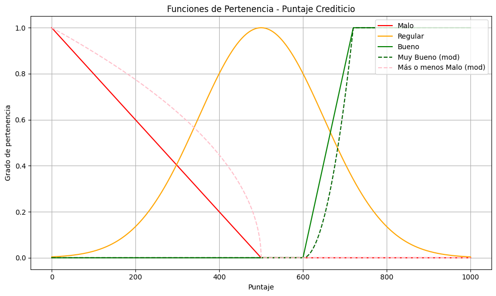
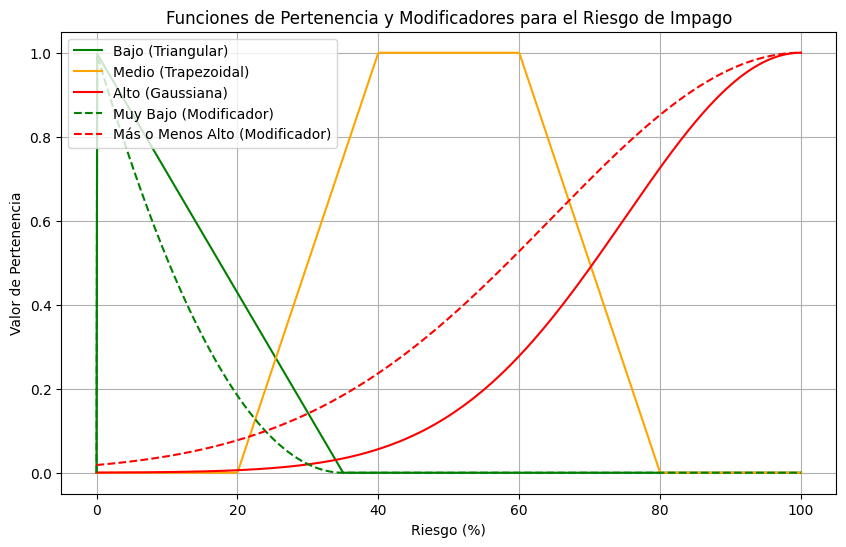
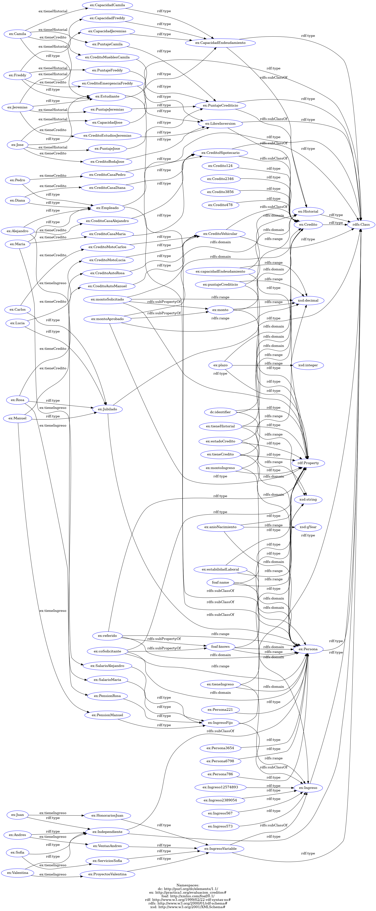

# Sistema de Evaluación de Créditos

**Autores:**  
Jhofred Jahat Camacho Gomez  
Sebastian Pabon Nuñez  
Juan Diego Giraldo Jaramillo  

**Enlace video tipo pitch**
*Enlace*

## Descripción del Problema

El objetivo del taller es desarrollar un sistema inteligente para la evaluación y aprobación de solicitudes de crédito bancario. El sistema debe:

- Evaluar el riesgo crediticio de los solicitantes utilizando múltiples variables
- Determinar si se aprueba o rechaza una solicitud de crédito
- Calcular las tasas de interés apropiadas para los créditos aprobados

El sistema implementa tres enfoques complementarios:

1. **Lógica Difusa**: Para manejar la incertidumbre en variables como ingresos, estabilidad laboral y riesgo de impago
2. **Ontologías**: Para representar y razonar sobre las relaciones entre entidades del dominio crediticio
3. **Sistema Experto**: Para aplicar reglas de decisión basadas en el conocimiento del dominio

Este enfoque híbrido permite una evaluación más robusta y flexible de las solicitudes de crédito, considerando tanto factores cuantitativos como cualitativos en el proceso de toma de decisiones.

## Lógica Difusa (Sci-kit Fuzzy)

El sistema de lógica difusa desarrollado en este proyecto tiene como objetivo principal evaluar el riesgo de impago de los solicitantes de crédito bancario. Este enfoque permite manejar la incertidumbre inherente a las variables que influyen en la toma de decisiones, como el ingreso mensual, la estabilidad laboral y el puntaje crediticio. A través de la definición de conjuntos difusos y reglas de inferencia, el sistema es capaz de realizar evaluaciones más flexibles y precisas, integrando tanto factores cuantitativos como cualitativos.

### Variables Difusas

#### Ingreso Mensual

- **Universo del Discurso:** $U = [0, 10]$ (en millones de pesos)
- **Funciones de Pertenencia:**
  - $\mu_{bajo}(x) = trapezoidal(x; 0, 0, 1.4, 2.8)$
  - $\mu_{medio}(x) = triangular(x; 1.4, 3, 5.5)$
  - $\mu_{alto}(x) = gaussiana(x; \mu=10, \sigma=2.8)$
- **Modificadores:**
  - $\mu_{más\_o\_menos\_alto}(x) = \sqrt{\mu_{alto}(x)}$
  - $\mu_{extremadamente\_alto}(x) = [\mu_{alto}(x)]^3$



---

#### Estabilidad Laboral

- **Universo del Discurso:** $U = [0, 10]$ (escala numérica de estabilidad)
- **Funciones de Pertenencia:**
  - $\mu_{inestable}(x) = trapezoidal(x; 0, 0, 2, 4)$
  - $\mu_{moderada}(x) = triangular(x; 3, 5.5, 7)$
  - $\mu_{estable}(x) = gaussiana(x; \mu=10, \sigma=2.5)$
- **Modificadores:**
  - $\mu_{muy\_estable}(x) = [\mu_{estable}(x)]^2$
  - $\mu_{más\_o\_menos\_estable}(x) = \sqrt{\mu_{estable}(x)}$



---

#### Puntaje Crediticio

- **Universo del Discurso:** $U = [0, 1000]$ (escala típica de puntajes crediticios)
- **Funciones de Pertenencia:**
  - $\mu_{malo}(x) = triangular(x; 0, 0, 500)$
  - $\mu_{regular}(x) = gaussiana(x; \mu=500, \sigma=150)$
  - $\mu_{bueno}(x) = trapezoidal(x; 600, 720, 1000, 1000)$
- **Modificadores:**
  - $\mu_{muy\_bueno}(x) = [\mu_{bueno}(x)]^2$
  - $\mu_{más\_o\_menos\_malo}(x) = \sqrt{\mu_{malo}(x)}$



---

#### Riesgo de Impago

- **Universo del Discurso:** $U = [0, 100]$ (escala de riesgo porcentual)
- **Funciones de Pertenencia:**
  - $\mu_{bajo}(x) = triangular(x; 0, 0, 35)$
  - $\mu_{medio}(x) = trapezoidal(x; 20, 40, 60, 80)$
  - $\mu_{alto}(x) = gaussiana(x; \mu=100, \sigma=25)$
- **Modificadores:**
  - $\mu_{muy\_bajo}(x) = [\mu_{bajo}(x)]^2$
  - $\mu_{más\_o\_menos\_alto}(x) = \sqrt{\mu_{alto}(x)}$



### Reglas Difusas

A continuación, se presentan las reglas definidas para evaluar el riesgo de impago basado en el ingreso mensual, la estabilidad laboral y el puntaje crediticio.

1. **Regla 1:**  
   Si el ingreso mensual es **bajo** y el puntaje crediticio es **malo**,  
   entonces el **riesgo de impago** es **alto**.

2. **Regla 2:**  
   Si el ingreso mensual es **medio** o la estabilidad laboral es **moderada**,  
   y el puntaje crediticio es **regular**,  
   entonces el **riesgo de impago** es **medio**.

3. **Regla 3:**  
   Si el ingreso mensual es **alto** o el puntaje crediticio es **bueno**,  
   entonces el **riesgo de impago** es **bajo**.

4. **Regla 4:**  
   Si el ingreso mensual **no es alto** y la estabilidad laboral es **inestable**,  
   entonces el **riesgo de impago** es **más o menos alto**.

5. **Regla 5:**  
   Si el ingreso mensual es **bajo** o el puntaje crediticio **no es bueno**,  
   entonces el **riesgo de impago** es **mas o menos alto**.

6. **Regla 6:**  
   Si el ingreso mensual es **medio** y el puntaje crediticio es **regular**,  
   entonces el **riesgo de impago** es **medio**.

7. **Regla 7:**  
   Si la estabilidad laboral es **muy estable** y el puntaje crediticio **no es malo**,  
   entonces el **riesgo de impago** es **bajo**.

8. **Regla 8:**  
   Si la estabilidad laboral es **inestable** y el puntaje crediticio es **malo**,  
   entonces el **riesgo de impago** es **alto**.

9. **Regla 9:**  
   Si el ingreso mensual es **medio** y el puntaje crediticio es **bueno**,  
   entonces el **riesgo de impago** es **bajo**.

### Proceso de Defuzzificación

Una vez asignados los valores de entrada (ingreso mensual, estabilidad laboral y puntaje crediticio), se ejecuta el sistema de inferencia difusa. Este proceso activa las reglas definidas en el sistema, combinando las salidas de cada regla en una única función difusa para la variable de salida: **riesgo de impago**.

Para convertir esta salida difusa en un valor numérico preciso, se aplica el proceso de **defuzzificación**. En este caso, se utiliza el método del **centroide**, también conocido como **centro de gravedad**.

El resultado final es un **valor crisp** (numérico y único), que se interpreta como el **porcentaje de riesgo de impago** del solicitante.

## Ontología y Razonamiento Semántico (RDFLib y OWL-RL)

### Clases

1. Persona
   - Estudiante
   - Jubilado
   - Empleado
   - Independiente
2. Ingreso
   - IngresoFijo
   - IngresoVariable
3. Crédito
   - LibreInversion
   - CreditoHipotecario
   - CreditoVehicular
4. Historial
   - PuntajeCrediticio
   - CapacidadEndeudamiento

### Propiedades

|     | Propiedad                   | Dominio            | Rango           | Comentario                                                                         |
| --- | --------------------------- | ------------------ | --------------- | ---------------------------------------------------------------------------------- |
| 1   | `foaf:name`                 | Persona            | `xsd:string`    | Usa FOAF para el nombre de la persona.                                             |
| 2   | `ex:anioNacimiento`         | Persona            | `xsd:gYear`     | Año de nacimiento.                                                                 |
| 3   | `ex:tieneIngreso`           | Persona            | Ingreso         | Relaciona a una persona con su ingreso (objeto).                                   |
| 4   | `ex:montoIngreso`           | Ingreso            | `xsd:decimal`   | Cuánto gana la persona.                                                            |
| 5   | `ex:tieneCredito`           | Persona            | Credito         | Indica los créditos que actualmente tiene activos.                                 |
| 6   | `ex:monto`                  | Credito            | `xsd:decimal`   | Monto del crédito.                                                                 |
| 7   | ` ↳ ex:montoSolicitado`     | *Credito*          | *`xsd:decimal`* | Subpropiedad de `ex:monto`: monto solicitado.                                      |
| 8   | ` ↳ ex:montoAprobado`       | *Credito*          | *`xsd:decimal`* | Subpropiedad de `ex:monto`: monto aprobado.                                        |
| 9   | `ex:plazo`                  | Credito            | `xsd:integer`   | Plazo en meses o años.                                                             |
| 10  | `ex:tieneHistorial`         | Persona            | Historial       | Conecta persona con su historial.                                                  |
| 11  | `ex:puntajeCrediticio`      | Historial          | `xsd:decimal`   | Escala de 0 a 1000, por ejemplo.                                                   |
| 12  | `ex:capacidadEndeudamiento` | Historial          | `xsd:decimal`   | Representa el monto máximo calculado.                                              |
| 13  | `ex:estadoCredito`          | Credito            | `xsd:string`    | Aprobado, Rechazado, Activo, PendienteDeAprobación.                                |
| 14  | `ex:estabilidadLaboral`     | Persona (Empleado) | `xsd:string`    | Alta, media, baja (útil para lógica difusa).                                       |
| 15  | `dc:identifier`             | Credito            | `xsd:string`    | Identificador único del crédito (usa Dublin Core).                                 |
| 16  | `foaf:knows`                | Persona            | Persona         | Permite modelar relaciones generales entre personas.                               |
| 17  | ` ↳ ex:referido`            | Persona            | Persona         | Subpropiedad de `foaf:knows`, indica quién refirió a quién.                        |
| 18  | ` ↳ ex:coSolicitante`       | Persona            | Persona         | Subpropiedad de `foaf:knows`, representa relaciones de co-solicitud o co-deudores. |

### Diagrama de Clases


### Comparativa de Grafos (Antes vs Después del Razonador)

La aplicación del razonamiento semántico ha permitido ampliar automáticamente el grafo RDF, generando nuevas afirmaciones que fortalecen la representación del conocimiento.
La segunda imagen muestra el **grafo después del razonamiento**. En este caso, se han añadido automáticamente nuevas afirmaciones implícitas derivadas de las reglas semánticas. Estas inferencias enriquecen el conocimiento representado en el grafo.

#### Antes:



#### Después:


### Documentación de los Casos de Generación de Nuevo Conocimiento

Este documento presenta tres casos de inferencia de nuevo conocimiento aplicados a una ontología del dominio de evaluación de créditos. Cada caso se ejemplifica con triples RDF antes y después del razonamiento automático, destacando cómo se generan nuevos hechos a partir de jerarquías de clases, propiedades y relaciones semánticas.

---

#### Caso 1: Inferencia por Jerarquía de Clases

Este caso se basa en la relación de **herencia entre clases**. Si una instancia pertenece a una subclase, entonces también pertenece a todas sus **superclases**.  
Por ejemplo, si `Estudiante` es una subclase de `Persona`, entonces todo `Estudiante` es también una `Persona`.

##### Antes de la inferencia

```turtle
# Freddy es un Estudiante
<http://practica1.org/evaluacion_creditos#Freddy> rdf:type <http://practica1.org/evaluacion_creditos#Estudiante> .

# ProyectosValentina es un IngresoVariable
<http://practica1.org/evaluacion_creditos#ProyectosValentina> rdf:type <http://practica1.org/evaluacion_creditos#IngresoVariable> .
```

##### Después de la inferencia

```turtle
# Freddy hereda ser Persona y Resource
<http://practica1.org/evaluacion_creditos#Freddy> rdf:type <http://practica1.org/evaluacion_creditos#Estudiante> .
<http://practica1.org/evaluacion_creditos#Freddy> rdf:type <http://practica1.org/evaluacion_creditos#Persona> .
<http://practica1.org/evaluacion_creditos#Freddy> rdf:type rdfs:Resource .

# ProyectosValentina hereda ser Ingreso y Resource
<http://practica1.org/evaluacion_creditos#ProyectosValentina> rdf:type <http://practica1.org/evaluacion_creditos#IngresoVariable> .
<http://practica1.org/evaluacion_creditos#ProyectosValentina> rdf:type <http://practica1.org/evaluacion_creditos#Ingreso> .
<http://practica1.org/evaluacion_creditos#ProyectosValentina> rdf:type rdfs:Resource .
```

---

#### Caso 2: Inferencia desde Dominio y Rango de Propiedades

En este caso, el razonamiento se basa en el uso del **dominio y rango** de una propiedad. Si se indica que una propiedad (como `tieneCredito`) tiene un dominio y rango definidos, se puede inferir el tipo de las entidades involucradas, incluso si inicialmente no estaban especificadas.

##### Antes de la inferencia

```turtle
# Marta tiene un crédito, pero no se conocen sus tipos
<http://practica1.org/evaluacion_creditos#Marta> <http://practica1.org/evaluacion_creditos#tieneCredito> <http://practica1.org/evaluacion_creditos#CreditoViajeMarta> .
```

##### Después de la inferencia

```turtle
# Se infiere que Marta es Persona y el crédito es de tipo Credito
<http://practica1.org/evaluacion_creditos#Marta> <http://practica1.org/evaluacion_creditos#tieneCredito> <http://practica1.org/evaluacion_creditos#CreditoViajeMarta> .
<http://practica1.org/evaluacion_creditos#Marta> rdf:type <http://practica1.org/evaluacion_creditos#Persona> .
<http://practica1.org/evaluacion_creditos#Marta> rdf:type rdfs:Resource .
<http://practica1.org/evaluacion_creditos#CreditoViajeMarta> rdf:type <http://practica1.org/evaluacion_creditos#Credito> .
<http://practica1.org/evaluacion_creditos#CreditoViajeMarta> rdf:type rdfs:Resource .
```

---

#### Caso 3: Inferencia desde Relación `subPropertyOf`

Este caso emplea la relación **`subPropertyOf`**. Si una propiedad (por ejemplo, `referido`) es una subpropiedad de otra (como `foaf:knows`), se puede inferir que toda relación con `referido` también es una relación con `foaf:knows`.

##### Antes de la inferencia

```turtle
# Juan tiene como referido a Rosa
<http://practica1.org/evaluacion_creditos#Juan> <http://practica1.org/evaluacion_creditos#referido> <http://practica1.org/evaluacion_creditos#Rosa> .
```

##### Después de la inferencia

```turtle
# Se infiere que Juan conoce a Rosa
<http://practica1.org/evaluacion_creditos#Juan> <http://practica1.org/evaluacion_creditos#referido> <http://practica1.org/evaluacion_creditos#Rosa> .
<http://practica1.org/evaluacion_creditos#Juan> <http://xmlns.com/foaf/0.1/knows> <http://practica1.org/evaluacion_creditos#Rosa> .
```

---

#### Casos Adicionales

##### Adicional 1: Inferencia por Subpropiedad (`montoSolicitado` es subproperty de `monto`)

**Relacionado con Caso 3**

```turtle
# Antes:
# CreditoAutoRosa tiene un monto solicitado de 500000
<http://practica1.org/evaluacion_creditos#CreditoAutoRosa> <http://practica1.org/evaluacion_creditos#montoSolicitado> 500000 .

# Después:
# CreditoAutoRosa tiene un monto de 500000
<http://practica1.org/evaluacion_creditos#CreditoAutoRosa> <http://practica1.org/evaluacion_creditos#montoSolicitado> 500000 .
<http://practica1.org/evaluacion_creditos#CreditoAutoRosa> <http://practica1.org/evaluacion_creditos#monto> 500000 .
```

---

##### Adicional 2: Inferencia por Herencia de Clase (`CreditoHipotecario` ⊆ `Credito`)

**Relacionado con Caso 1**

```turtle
# Antes:
# CreditoCasaAlejandro es un CreditoHipotecario solamente
<http://practica1.org/evaluacion_creditos#CreditoCasaAlejandro> rdf:type <http://practica1.org/evaluacion_creditos#CreditoHipotecario> .

# Después:
# CreditoCasaAlejandro es ahora también de tipo Credito
<http://practica1.org/evaluacion_creditos#CreditoCasaAlejandro> rdf:type <http://practica1.org/evaluacion_creditos#CreditoHipotecario> .
<http://practica1.org/evaluacion_creditos#CreditoCasaAlejandro> rdf:type <http://practica1.org/evaluacion_creditos#Credito> .
<http://practica1.org/evaluacion_creditos#CreditoCasaAlejandro> rdf:type rdfs:Resource .
```

---

##### Adicional 3: Inferencia por Herencia de Clase (`CapacidadEndeudamiento` ⊆ `Historial`)

**Relacionado con Caso 1**

```turtle
# Antes:
# CapacidadJose es una CapacidadEndeudamiento solamente
<http://practica1.org/evaluacion_creditos#CapacidadJose> rdf:type <http://practica1.org/evaluacion_creditos#CapacidadEndeudamiento> .

# Después:
# CapacidadJose es ahora también de tipo Historial
<http://practica1.org/evaluacion_creditos#CapacidadJose> rdf:type <http://practica1.org/evaluacion_creditos#CapacidadEndeudamiento> .
<http://practica1.org/evaluacion_creditos#CapacidadJose> rdf:type <http://practica1.org/evaluacion_creditos#Historial> .
<http://practica1.org/evaluacion_creditos#CapacidadJose> rdf:type rdfs:Resource .
```

---

##### Adicional 4: Inferencia por Dominio y Rango

**Relacionado con Caso 2**

```turtle
# Antes:
# Freddy tiene un ingreso cuyo tipo no estaba definido
<http://practica1.org/evaluacion_creditos#Freddy> <http://practica1.org/evaluacion_creditos#tieneIngreso> <http://practica1.org/evaluacion_creditos#ingresoDesconocidoFreddy> .

# Después:
# Ingreso desconocido de Freddy ahora es de tipo Ingreso
<http://practica1.org/evaluacion_creditos#Freddy> <http://practica1.org/evaluacion_creditos#tieneIngreso> <http://practica1.org/evaluacion_creditos#ingresoDesconocidoFreddy> .
<http://practica1.org/evaluacion_creditos#ingresoDesconocidoFreddy> rdf:type <http://practica1.org/evaluacion_creditos#Ingreso> .
<http://practica1.org/evaluacion_creditos#ingresoDesconocidoFreddy> rdf:type rdfs:Resource .
```

---

## Sistema Experta

### Reglas Sistema Experto

#### Reglas Prioridad Alta - Rechazar Credito

- **Regla 1**: Si la persona es menor de edad (< 18 años), se rechaza el crédito.
- **Regla 2**: Si la persona es mayor de 75 años, se rechaza el crédito.
- **Regla 3**: Si el riesgo de impago > 0.8, se rechaza el crédito.
- **Regla 4**: Si el sueldo es menor a 1 millones de pesos, se rechaza el crédito. 
- **Regla 5**: Si el puntaje crediticio < 300, se rechaza el crédito.
- **Regla 6**: Si el monto solicitado supera a la capacidad de endeudamiento, se rechaza el crédito.
- **Regla 7**: Si el plazo del crédito supera los 60 meses, se rechaza el crédito.

#### Reglas Prioridad Media - Aceptar Credito

- **Regla 8**: Si el monto solicitado es menor o igual a 5 millones de pesos, se aprueba sin calcular interés.
- **Regla 9**: Si el riesgo de impago es ≤ 0.4, se aprueba sin calcular interés.
- **Regla 10**: Si el puntaje es ≥ 500, se aprueba sin calcular interés.
- **Regla 11**: Si el ingreso mensual es mayor a 5 millones de pesos, se aprueba sin calcular interés.

#### Reglas de Asignación de Interés

- **Regla 12**: Si el crédito está aprobado y aún no tiene interés, se asigna un interés base según el riesgo y el puntaje.
- **Regla 13**: Si riesgo < 0.3 y puntaje ≥ 800, se aplica un descuento de 2 puntos al interés.
- **Regla 14**: Si se solicita > 50 millones de pesos y el riesgo es mayor a 0.5, se aplica un recargo de 2 puntos.
- **Regla 15**: Si el plazo es corto (≤ 12 meses), se descuenta 1 punto del interés.
- **Regla 16**: Si el monto solicitado es ≤ 5 millones de pesos, se descuenta 1.5 puntos por tratarse de microcrédito.
- **Regla 17**: El interés se ajusta para que esté entre 5% y 20%.

#### Regla de Revisión Final

- **Regla 18**: Si no se cumple ninguna regla anterior, el crédito queda en estado "revisar" con interés 0.0.

### Explicación de los Hechos en el Sistema Experto

A continuación se explican los hechos utilizados en el sistema experto para evaluación de créditos:

#### Hechos(FACT)

---

#####  `PersonaFact`

Representa los datos personales del solicitante del crédito.

| Campo             | Tipo           | Descripción |
|------------------|----------------|-------------|
| `name`           | `str`          | Nombre de la persona. |
| `anio_nacimiento`| `int`          | Año de nacimiento; útil para calcular la edad y validar si está en edad laboral. |
| `riesgo_impago`  | `float` o `int`| Probabilidad estimada de que la persona no pague el crédito. Se usa para ajustar la tasa de interés. |

---

#####  `IngresoFact`

Contiene información sobre los ingresos del solicitante.

| Campo    | Tipo           | Descripción |
|----------|----------------|-------------|
| `monto`  | `float` o `int`| Ingreso económico mensual o anual. Se utiliza para calcular la capacidad de pago. |

---

#####  `HistorialFact`

Describe el historial financiero del solicitante.

| Campo                    | Tipo           | Descripción |
|--------------------------|----------------|-------------|
| `puntaje`                | `float` o `int`| Puntaje de crédito asignado por agencias financieras. |
| `capacidad_endeudamiento`| `float` o `int`| Cuánto puede endeudarse según sus ingresos y deudas actuales. |

---

#####  `CreditoFact`

Define la solicitud de crédito realizada por la persona.

| Campo       | Tipo           | Descripción |
|-------------|----------------|-------------|
| `solicitado`| `float` o `int`| Monto del crédito solicitado. |
| `plazo`     | `int`          | Plazo en meses para devolver el crédito. |
---

##### `ResultadoFact`

Resultado del análisis y procesamiento de la solicitud. También incluye indicadores internos para controlar la lógica del sistema.

| Campo                        | Tipo                        | Descripción |
|-----------------------------|-----------------------------|-------------|
| `aprobado`                  | `str`                       | Indica si el crédito fue aprobado (`"sí"` o `"no"`). |
| `interes`                   | `float`, `int` o `None`     | Tasa de interés final asignada. |
| `base_calculada`            | `bool`                      | Si ya se hizo el cálculo inicial de interés. |
| `descuento_aplicado`        | `bool`                      | Si ya se aplicó un descuento por buen historial. |
| `recargo_aplicado`          | `bool`                      | Si ya se aplicó un recargo por alto riesgo. |
| `beneficio_plazo_corto_aplicado` | `bool`                | Si ya se aplicó una mejora por corto plazo de pago. |
| `preferencial_aplicado`     | `bool`                      | Si ya se aplicaron condiciones especiales al solicitante. |
| `microcredito_aplicado`     | `bool`                      | Si el sistema consideró la solicitud como un microcrédito. |
| `clamp_aplicado`            | `bool`                      | Si ya se ajustó el interés dentro de los límites permitidos (5%-20%). |

---

